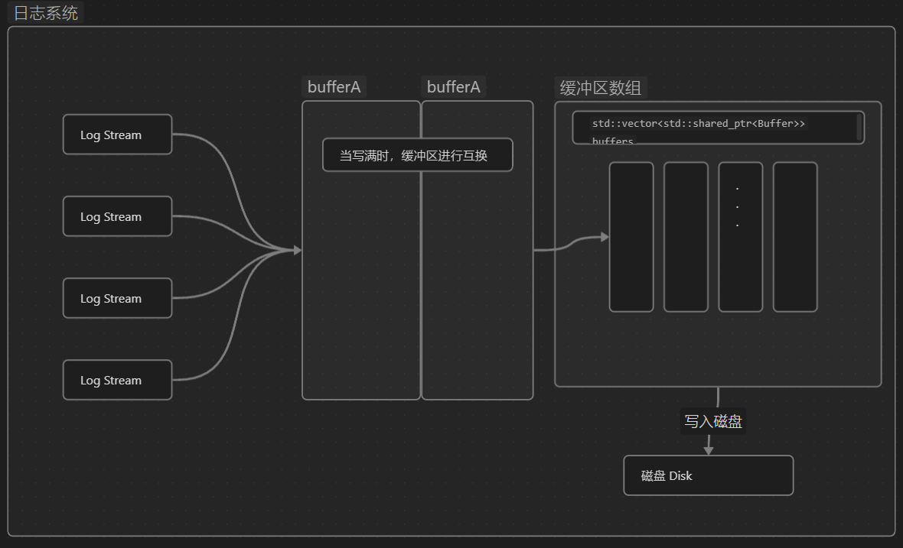

#项目/WebServer/主从Reactor 
[[基于双缓冲区的日志系统.canvas|基于双缓冲区的日志系统]]

这一个双缓冲区的日志系统，有三个大的模块组成，一个是每次调用日志时都会创建一个新的对象的logging模块，以及将保证数据流输入的logstream模块，还有一个由于buffer写入磁盘速度很慢，所有用异步同步的async模块。

在当logging模块析构时，会将log_stream中的数据存在一个内存变量中，然后将这个内存变量写到磁盘中，也就是用另一个类 调用异步同步将日志写入到磁盘中，LogStream 的内容写到了 AsyncLogging 缓冲区中后，在异步模块中，准备两个buffer，

##### 双缓冲技术的基本思路

该日志系统场景为多生产者，单消费者的场景，多生产者将日志输入到缓冲区中，单消费者将缓冲区的数据写到磁盘中去。
数据结构采用双缓冲区的形式将日志中的数据传到磁盘中，那么是怎么使用双缓冲区的呢？
简单来说就是创建好两个缓冲区A B，前端将数据发送到A中，磁盘从B中读取数据并清空，如果A中数据满了，则AB两个缓冲区进行交换；
总之就是将多条日志消息组合成一个大的日志写入到磁盘中。
buffer就是4000字节

